# 🏝️ Cyber-Island: The Last Signal — Game Stage Audit Report

**Date**: October 2, 2026  
**Project Phase**: `ALPHA (Integration & Monorepo Ready)`  
**Repository Architecture**: Monorepo (`/backend` + `/frontend`)

---

## Executive Summary

**Cyber-Island: The Last Signal** is a 2D retro-style cybersecurity adventure RPG built with **Phaser 3**, **Vite**, and **TypeScript/Express/Prisma backend**. Players control a stranded cyber specialist exploring an island, interacting with resident NPCs, solving cybersecurity challenges (cryptography, encoding, steganography, network recon), collecting boat repair components, and escaping the island.

Both the **Frontend (Phaser 3 Game Engine & UI)** and **Backend (REST API, Auth, Contest & Progress Engine)** implementations are complete. The workspace has been reorganized into a clean **Monorepo Architecture** with root orchestration.

---

## 🏗️ Monorepo Architecture Overview

```
Cyber-island/
├── package.json              # Monorepo root scripts (pnpm dev, build, test)
├── pnpm-workspace.yaml       # Workspace packages (backend, frontend)
├── .gitignore                # Root gitignore
├── PROMPT_GAME_STAGE_AUDIT.md# Antigravity audit prompt tool
├── GAME_STAGE_REPORT.md      # Current stage report (this file)
│
├── frontend/                 # Phaser 3 + Vite Client Application
│   ├── index.html            # Game viewport container & pixel art UI overlays
│   ├── package.json          # Dependencies: Phaser 3, Vite
│   ├── public/
│   │   └── assets/           # World textures & tilemap graphics
│   └── src/
│       ├── config/           # Environment config (env.js, storyData.js)
│       ├── data/             # World tilemap & collision data
│       ├── entities/         # Interactive Entities (Player, NPC, InteractiveObject)
│       ├── scenes/           # Phaser Scenes (BootScene, MenuScene, GameScene, MainScene)
│       ├── services/         # API Service (api.js - REST integration)
│       ├── styles/           # Retro pixel CSS UI stylesheet (style.css)
│       └── systems/          # Interaction, Dialogue, Challenge UI, Quest Engine
│
└── backend/                  # Node.js + Express + Prisma REST API
    ├── src/
    │   ├── config/           # Environment variables validation (env.ts)
    │   ├── controllers/      # Auth, Contest, Team, Admin controllers
    │   ├── lib/              # Prisma client instance, JWT, HttpErrors
    │   ├── middleware/       # Team Auth, Admin Auth, Error Handlers
    │   ├── routes/           # REST endpoints (/api/auth, /api/contest, /api/team, /api/admin)
    │   ├── services/         # Core business logic services
    │   ├── types/            # TypeScript interfaces
    │   └── utils/            # Time, CSV export, progress evaluation helpers
    ├── prisma/               # Schema definition & seed scripts
    ├── tests/                # Vitest test suite (Auth, Contest, Progress, Results)
    ├── Dockerfile            # Container build specification
    └── docker-compose.yml    # Database (PostgreSQL) + Backend service setup
```

---

## ⚙️ Backend System Status

| Component | Status | Details |
| :--- | :---: | :--- |
| **Framework & Language** | ✅ Complete | Node.js, Express 4, TypeScript |
| **Database ORM** | ✅ Complete | Prisma 6 with PostgreSQL |
| **Authentication** | ✅ Complete | JWT Access & Refresh tokens, Team session tracking, Admin role auth |
| **Contest Lifecycle Engine** | ✅ Complete | Contest states (`NOT_STARTED`, `RUNNING`, `PAUSED`, `ENDED`, `FINALIZED`), manual start/end/extend controls |
| **Team Progress Engine** | ✅ Complete | Atomic, race-condition safe stage completions (`completeNextStage`), time penalty calculation, hints usage tracking |
| **Admin Controls** | ✅ Complete | Live leaderboard (`compareRank`), manual score/penalty adjustments, manual stage overrides |
| **Results & CSV Export** | ✅ Complete | Official contest results generation & CSV download endpoint |
| **Test Suite** | ✅ Complete | Vitest integration test suites created (`tests/{auth,contest,progress,results}.test.ts`) |
| **Containerization** | ✅ Complete | Production `Dockerfile` and `docker-compose.yml` for database deployment |

---

## 🎮 Frontend System Status

| Component | Status | Details |
| :--- | :---: | :--- |
| **Game Engine** | ✅ Complete | Phaser 3 Arcade Physics, 1280x720 scaling with dynamic viewport sync |
| **Scene Controllers** | ✅ Complete | `BootScene` (asset loading & procedural texturing), `MenuScene`, `GameScene` (world exploration) |
| **UI Overlays** | ✅ Complete | Custom CSS pixel art windows over game canvas (Menu, Instructions, Dialogue, Challenge Modal, Quest Bar, Victory Screen) |
| **Interaction System** | ✅ Complete | Distance-based entity interaction via `E` or `SPACE` key |
| **Dialogue Engine** | ✅ Complete | Branching NPC conversation trees with animated typewriter effect |
| **Challenge Modal UI** | ✅ Complete | Interactive cybersecurity puzzle solver supporting cipher submissions, hints, and immediate feedback |
| **Quest Tracking** | ✅ Complete | Real-time inventory tracking for 5 boat repair parts (Hull, Engine, Navigation, Sail, Ignition Key) |
| **API Client Service** | ✅ Complete | `src/services/api.js` added for backend sync (Team Login, Stage Completion, Hint fetch, Contest status) |

---

## 🔐 Cybersecurity Challenges & Game Story Progression

```mermaid
flowchart LR
    A[Start: Shipwrecked on Beach] --> B[Stage 1: Base64 Signal]
    B -->|Reward: Boat Hull| C[Stage 2: ROT13 Relay]
    C -->|Reward: Outboard Engine| D[Stage 3: Steganography Log]
    D -->|Reward: Navigation Radio| E[Stage 4: Network Recon]
    E -->|Reward: Canvas Sail| F[Stage 5: Master Encryption Lock]
    F -->|Reward: Ignition Key| G[🏆 Escape Island Skiff]
```



1. **Stage 1 (Base64 Decryption)**: Transmit emergency beacon decode.
   - *Reward*: Rebuilt Wooden Boat Hull.
2. **Stage 2 (ROT13 Cipher)**: Unscramble radio tower communication headers.
   - *Reward*: Outboard Marine Engine.
3. **Stage 3 (Steganographic Concealment)**: Extract hidden coordinates from image metadata.
   - *Reward*: Satellite Navigation Radio.
4. **Stage 4 (Network Header Recon)**: Inspect HTTP network headers for authorization key.
   - *Reward*: Heavy Canvas Sail.
5. **Stage 5 (Master Encryption Lock)**: Solve combined cryptographic lock at lighthouse terminal.
   - *Reward*: Ignition Key -> **Escape Skiff Access Activated**.

---

## 📊 Summary of Completed vs. Pending Tasks

- [x] Restructure monorepo directory architecture and configure root scripts.
- [x] Create API Client Service layer (`frontend/src/services/api.js`) and environment config.
- [x] Consolidate frontend asset paths and standardize modular CSS layout (`frontend/src/styles/style.css`).
- [x] Build backend API, database schema, authentication, and progress tracking service.
- [x] Build frontend Phaser 3 game world, dialogue system, challenge modal UI, and quest engine.
- [x] Generate Antigravity audit prompt (`PROMPT_GAME_STAGE_AUDIT.md`) and stage status document (`GAME_STAGE_REPORT.md`).
- [ ] **Next Step**: Start local database container (`docker compose up -d db`) and execute initial backend migrations (`pnpm db:push && pnpm db:seed`).
- [ ] **Next Step**: Connect live frontend login flow to backend `/api/auth/team/login`.

---

## 🚀 How to Run the Project

### 1. Install Dependencies
From the project root directory:
```bash
pnpm install
```

### 2. Start Database & Backend
```bash
# Start PostgreSQL database container
docker compose up -d db

# Run Prisma schema push & seed default teams/stages
pnpm db:push
pnpm db:seed

# Start Backend Dev Server (port 3000)
pnpm dev:backend
```

### 3. Start Frontend Game Client
```bash
# Start Frontend Dev Server (port 5173)
pnpm dev:frontend
```

---

*Report generated automatically for team review.*
